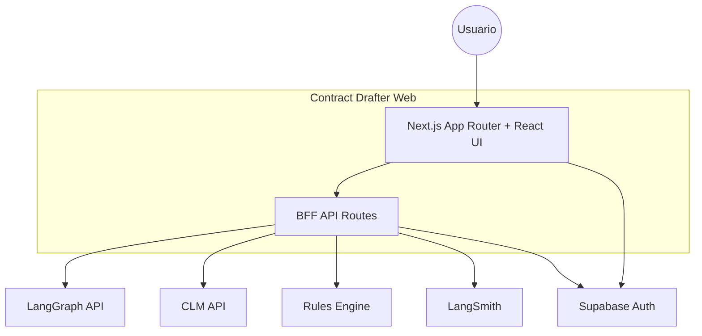
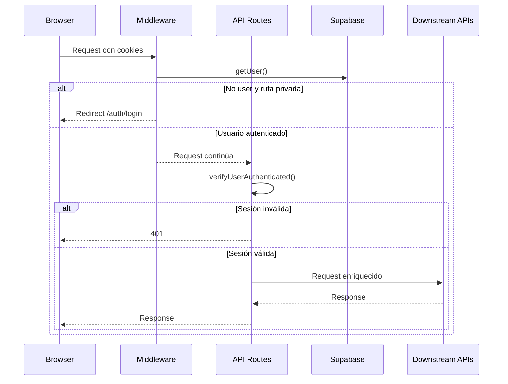

# Documento C4: comunicación con el backend (Contract Drafter / `apps/web`)

## Estado actual

Este documento describe la arquitectura vigente del MVP de Contract Drafter al 2026-03-31.

Ya no forman parte del producto activo:
- Web search
- Scraping con Firecrawl
- Transcripción de audio/video con Whisper/Groq

Los ADRs de esas features se conservan solo como referencia histórica en `docs/adr/`.

## Alcance y límites

| Incluido | Fuera de alcance |
|----------|-------------------|
| Navegador → UI React → BFF `/api/*` → servicios backend | Detalle interno de nodos/prompts de LangGraph |
| Proxy Next.js hacia LangGraph, CLM, Rules Engine y LangSmith | Infra de despliegue |
| Integración actual y futura de draft insertion vía LangGraph | Implementación interna del paquete `apps/agents` |

## Diagrama C4 — Nivel 1 (contexto)



## Flujo de autenticación



Puntos clave:
- `middleware.ts` protege rutas privadas.
- Las rutas BFF validan sesión con `verifyUserAuthenticated()`.
- El proxy a LangGraph inyecta `supabase_session` y `supabase_user_id` en `config.configurable`.
- `NEXT_PUBLIC_LOCAL_UI_MODE=true` permite validar la UI sin backends reales.

## Diagrama C4 — Nivel 2 (contenedores)

```mermaid
flowchart TB
  subgraph Browser [Navegador]
    Pages[Pages + Layouts]
    Contexts[Graph / Thread / Assistant Contexts]
    Components[Canvas / Chat / Clause Selector / Requests]
    Worker[Graph Stream Worker]
  end

  subgraph Next [Next.js Server]
    Proxy[api/[..._path]]
    Clauses[api/clauses/*]
    Contracts[api/contracts/*]
    Rules[api/rules/*]
    Requests[api/requests/*]
    DraftInsert[api/draft/clauses/insert]
    Store[api/store/*]
    Runs[api/runs/*]
  end

  LG[LangGraph]
  CLM[CLM]
  RE[Rules Engine]
  LS[LangSmith]

  Pages --> Contexts
  Contexts --> Components
  Components --> Worker
  Worker --> Proxy
  Components --> Clauses
  Components --> Contracts
  Components --> Rules
  Components --> Requests
  Components --> DraftInsert
  Components --> Store
  Components --> Runs

  Proxy --> LG
  Clauses --> CLM
  Contracts --> CLM
  Requests --> CLM
  Rules --> RE
  DraftInsert --> LG
  Runs --> LS
  Store --> LG
```

## Responsabilidades por ruta

| Ruta | Rol actual |
|------|------------|
| `/api/[..._path]` | Proxy autenticado a LangGraph |
| `/api/clauses` | Catálogo de cláusulas |
| `/api/contracts` | Persistencia mock-first y export del draft contractual |
| `/api/rules/validate` | Validación de compatibilidad |
| `/api/rules/suggest` | Sugerencia de cláusulas |
| `/api/requests` | Intake queue de solicitudes CLM |
| `/api/draft/clauses/insert` | Costura BFF para futuro `insertClause` en LangGraph |
| `/api/store/*` | Preferencias/memoria ligada a LangGraph |
| `/api/runs/*` | Feedback y share en LangSmith |

## Casos de uso principales

### UC1 — Conversación y streaming del draft

- Actor: usuario.
- Flujo: `Composer` → `GraphContext` → `StreamWorkerService` → `/api/[..._path]` → LangGraph.
- Resultado: mensajes y artifact markdown se actualizan en streaming.

### UC2 — Navegación e inserción de cláusulas

- Actor: usuario.
- Flujo: `ClauseSelector` consulta `/api/clauses` y `/api/clauses/categories`.
- Validación: `/api/rules/validate`.
- Inserción actual: local en frontend.
- Inserción futura: `/api/draft/clauses/insert` bajo feature flag.

### UC3 — Sugerencias y validación contractual

- Actor: usuario.
- Flujo: `ContractToolbar` y `ClauseSelector` llaman `/api/rules/validate` y `/api/rules/suggest`.
- Backend esperado: Rules Engine dedicado.
- Fallback actual: heurísticas locales en `apps/web`.

### UC4 — Intake de requests desde CLM

- Actor: usuario.
- Flujo: `RequestsPanel` y `ThreadHistory` llaman `/api/requests`.
- Resultado: cada request puede abrir un thread seedado con artifact y contexto inicial.

### UC5 — Persistencia y export del contrato

- Actor: usuario.
- Flujo: `RequestsPanel`, thread seedado o draft genérico → `/api/contracts` para crear/listar/actualizar.
- Navegación: `ThreadHistory` expone una vista `Contracts` para reabrir drafts persistidos.
- Export actual: `ArtifactHeader` sincroniza el draft activo y luego llama `/api/contracts/[id]/export`.
- Resultado: el draft queda enlazado al thread y puede descargarse como payload `pdf` o `docx`.

### UC6 — Inserción de cláusulas vía LangGraph

- Actor: usuario o staging interno.
- Activación: `NEXT_PUBLIC_AGENT_CLAUSE_INSERTION_ENABLED=true`.
- Ruta: `/api/draft/clauses/insert`.
- Estado actual: si LangGraph no está configurado, responde `501` y el frontend cae a fallback local.
- Documento de contrato: `docs/langgraph-insert-clause-integration.md`.

### UC7 — Observabilidad y store

- `/api/runs/share` y `/api/runs/feedback` envían datos a LangSmith.
- `/api/store/*` mantiene preferencias y memoria del asistente.

## Variables de entorno relevantes

```bash
LANGGRAPH_API_URL=
LANGCHAIN_API_KEY=

CLM_API_URL=
CLM_API_KEY=

RULES_ENGINE_URL=
RULES_ENGINE_API_KEY=

NEXT_PUBLIC_AGENT_CLAUSE_INSERTION_ENABLED=false
LANGGRAPH_INSERT_CLAUSE_PATH=

NEXT_PUBLIC_LOCAL_UI_MODE=false
NEXT_PUBLIC_SUPABASE_URL=
NEXT_PUBLIC_SUPABASE_ANON_KEY=
```

## Integraciones removidas del producto

Estas integraciones ya no deberían reaparecer en docs operativos ni en código vivo del MVP:
- Web search
- Firecrawl URL scraping
- Whisper/Groq transcription

Si se necesita revisar cómo funcionaban, usar los ADRs históricos:
- `docs/adr/001-web-search-implementation.md`
- `docs/adr/002-audio-transcription-implementation.md`
- `docs/adr/004-firecrawl-document-scraping.md`

## Resumen

La arquitectura actual del MVP es más simple que la de Open Canvas original:
- artifact solo markdown
- flujo contractual centrado en clauses, contracts, rules y requests
- LangGraph mantenido como motor de orquestación
- fallback local explícito mientras `apps/agents` implementa `insertClause`
